# bkahlert/build-runner [](https://github.com/bkahlert/build-runner/actions/workflows/build.yml) [](https://github.com/bkahlert/build-runner/blob/master/LICENSE) [![Buy Me A Unicorn](https://img.shields.io/static/v1?label=&message=Buy%20Me%20A%20Unicorn&color=c21f73&logo=data%3Aimage%2Fsvg%2Bxml%3Bbase64%2CPHN2ZyB4bWxucz0iaHR0cDovL3d3dy53My5vcmcvMjAwMC9zdmciIHZpZXdCb3g9IjAgMCA3MiA3MiI%2BPHBhdGggZmlsbD0iI0ZGRiIgZD0iTTIzLjc1NCAxMi4zNjJsMS42NjcgNy4xNjctNS4zMzMgNS4zMzMtOC4zMzQgMTQuMzMzIDEgNC42NjcgMi4xNjcgMS4zMzMgNC0uMTY3IDMuNS0zLjMzMyA2LjgzMy0xLjgzM3MxLjMzNCAxLjUgMi4xNjcgMyAzLjY2NyA0LjE2NyAzLjY2NyA0LjE2N2wuNSA2LTEuODMzIDYuMTY2LTIgMi44MzNzMjIgOS41IDMzLjE2Ni03bC0uNS02LTEuODMzLTUtMy4zMzMtNS4xNjYtMS0xLjUtLjE2Ny01LjE2Ny0yLjgzMy01LjMzMy01LTMtMi42NjctNC41LTUuMTY3LTQuMTY3LTYuNS0xLjUtNS42NjYgMS00LjE2Ny0yLjE2Ny0yLjMzNC0uMTY2eiIvPjxwYXRoIGZpbGw9IiNFQTVBNDciIGQ9Ik01MC42NzEgMjMuMTU1bDUuMjA4IDQuMDk1czUuNTY0IDguMjE4LS4zMjUgMTcuODJjLTcuMDUgMTEuNDkyIDAgMCAwIDAtMS42MTkgMy40NzUtMi4zMTUgNi43NDItMS43MzkgOS43MjJsLTUuMzEtNC40MTdWMzQuMjkybDIuMTY2LTExLjEzN3pNMjUuODk4IDE5LjI3MWwtMTUuMTEzLTcuMjUgNS4xNjYgNi4xMTkgNS4yMjQgNS44NTUgNC43MjMtNC43MjQiLz48cGF0aCBmaWxsPSIjOTJEM0Y1IiBkPSJNMjkuNzM3IDEzLjYzMWwxMC43NjcuMTM2czkuMjM4IDQuMDY2IDEwLjUzNiAxMS44MTZsLjY4NyA4Ljk1N2MtMi42MzMgNi41MzktMy4wNTYgMTQuMTI3IDIuMDg5IDIwLjgzNCAwIDAtNy4xNDUgMS4zMjEtOS44OTUtNy4xMUw0Mi4zMzggNDMuNWwuMzI1LTYuMDM0IDEuNDE3LTUuNjQzLS4yODMtNC44OTMtMi4yNzYtNC4zMTItMy41MzItMi44NDEtNS43OTItMi4wOC0yLjQ2LTQuMDY2Ii8%2BPHBhdGggZmlsbD0iIzYxQjJFNCIgZD0iTTU4LjQ1NSAzNi43NXM1LjUyIDYuNDA3IDYuOTk4IDE1LjEyYTguMDIgOC4wMiAwIDAxLS4xMzggMy4yNThjLS40MzEgMS43NTItLjgxNyA0Ljk5OC4xNDYgNy4zODMuNDY5IDEuMTYxLS41NjIgMi4zNjUtMS43ODkgMi4xMTEtMy43MS0uNzY4LTkuMjQzLTMuNjQ3LTEwLjI1Ni04LjA4N2ExLjgyNiAxLjgyNiAwIDAxLS4wNDItLjMyMWwtLjI2Ni01Ljc0NmMtLjAxMy0uMjg2LjA1Mi0uNTcuMTg3LS44MjFsMy42OTItNi44MzZjLjA2Ny0uMTIzLjExNy0uMjU1LjE0OS0uMzkybDEuMzE5LTUuNjY5Ii8%2BPGc%2BPHBhdGggZmlsbD0ibm9uZSIgc3Ryb2tlPSIjMDAwIiBzdHJva2UtbGluZWNhcD0icm91bmQiIHN0cm9rZS1saW5lam9pbj0icm91bmQiIHN0cm9rZS1taXRlcmxpbWl0PSIxMCIgc3Ryb2tlLXdpZHRoPSIyIiBkPSJNNTguNDU1IDM3Ljc4M0M2MC4yMjMgNDAuMTQ0IDY1IDQ0LjQ2NSA2NC41IDU0LjAyTTMyLjUgNDEuODg1czguNDc4IDYuNzgzIDAgMTguNzY1TTI0LjgwOSAxOS4xMzRMMTAuMjUgMTEuNzVsMTAuOTI1IDEyLjI0NSIvPjxwYXRoIGZpbGw9Im5vbmUiIHN0cm9rZT0iIzAwMCIgc3Ryb2tlLWxpbmVjYXA9InJvdW5kIiBzdHJva2UtbGluZWpvaW49InJvdW5kIiBzdHJva2UtbWl0ZXJsaW1pdD0iMTAiIHN0cm9rZS13aWR0aD0iMiIgZD0iTTM1LjE5NiAzMC44N2MuNTUgOC4zNTUtOS4zMjIgOS43MDMtMTEuOTU0IDEwLjMzNC0uMzMyLjA4LS42MzIuMjUtLjg3My40OTJsLTIuMjIzIDIuMjIzYy0uMzUuMzUtLjgyNC41NDYtMS4zMTguNTQ2aC0zLjUxMmEyLjc5NSAyLjc5NSAwIDAxLTIuNjUxLTEuOTExbC0uNTMxLTEuNTkzYTIuNzk1IDIuNzk1IDAgMDEuMjU1LTIuMzIybDguNzg2LTE0LjY0NCA0LjcyNC00LjcyNC0yLjExNi02LjkwNXM3LjgwMy0uNjk5IDguNDE0IDUuMzNjMCAwIDE2LjkyOCAyLjQ0MiAxMC41NTMgMTkuMzg0IDAgMC0xLjYyNSA1Ljk0OSAyLjM3NSAxMS4xODRNMzAuOTE3IDE0LjAyUzUzLjE2IDEwIDUwLjg3NSAzMy45OCIvPjxwYXRoIGZpbGw9Im5vbmUiIHN0cm9rZT0iIzAwMCIgc3Ryb2tlLWxpbmVjYXA9InJvdW5kIiBzdHJva2UtbGluZWpvaW49InJvdW5kIiBzdHJva2UtbWl0ZXJsaW1pdD0iMTAiIHN0cm9rZS13aWR0aD0iMiIgZD0iTTQ5LjkxOSAyMy4xNTVzMTQuNzY2IDYuNTg3IDUuNDU2IDIyLjIyYzAgMC01LjM3NSA2LjU2My42MjUgMTMuNjA0Ii8%2BPGNpcmNsZSBjeD0iMjQuNDE3IiBjeT0iMjguOTMiIHI9IjIiLz48L2c%2BPC9zdmc%2B)](https://www.buymeacoffee.com/bkahlert)

## About

**bkahlert/build-runner** is a multiplatform Alpine based SSH accessible Docker image with Docker CLI and OpenJDK 11 installed. It is compatible with IntelliJ
IDEA [run targets feature](https://www.jetbrains.com/help/idea/run-targets.html#target-types).

[  
*SSH connection to a running instance of bkahlert/build-runner*](../../raw/master/docs/ssh.svg)

# TODO

```shell
docker run -d --rm \
  -e AUTHORIZED_KEYS="$(< ~/.ssh/id_rsa20.pub)" \
  -p 2022:2022 \
  "build-runner:local"
  
rsync -arvvz -e 'ssh -p 2022' --progress CITATION.cff runner@localhost:/home/runner

rsync CITATION.cff runner@localhost:/home/runner

ssh localhost
```

```shell
docker buildx bake --set "*.args.AUTHORIZED_KEYS=$(< ~/.ssh/id_rsa20.pub)" \
&& docker run -d --rm \
  -e AUTHORIZED_KEYS="$(< ~/.ssh/id_rsa20.pub)" \
  -p 2022:2022 \
  "build-runner:local"
```

```shell
rsync CITATION.cff runner@localhost:/home/runner && ssh -T 'cat /var/log/sshd.log' localhost
```

## Build locally

```shell
git clone https://github.com/bkahlert/build-runner.git
cd build-runner

# Build image and output to docker (default)
docker buildx bake

# Build multi-platform image
docker buildx bake image-all
```

## Image

* [Docker Hub](https://hub.docker.com/r/bkahlert/build-runner/) `bkahlert/build-runner`
* [GitHub Container Registry](https://github.com/users/bkahlert/packages/container/package/build-runner) `ghcr.io/bkahlert/build-runner`

Following platforms for this image are available:

* linux/amd64
* linux/arm64/v8

## Usage

### Run as an application

If you pass arguments to the container, they will be treated like a regular command line. The container will run the command line and terminate.

```shell
docker run --rm -it \
  -v "$(pwd):$(pwd)" \
  -w "$(pwd)" \
  bkahlert/build-runner:edge \
  javac --version
```

### Run as a service / SSH server

Starting the container without any arguments will launch an SSH server that will listen for connections.

By default, authentication uses public key. Since no public key is provided in the `bkahlert/build-runner`,
a public key must be provided at startup:

```shell
# start container
docker run -d --rm \
  -e AUTHORIZED_KEYS="$(< ~/.ssh/id_rsa.pub)" \
  -v "$(pwd):$(pwd)" \
  -w "$(pwd)" \
  -p 2022:2022 \
  "build-runner:edge"

# connect
ssh \
  -i ~/.ssh/id_rsa \
  -o StrictHostKeyChecking=no \
  -o UserKnownHostsFile=/dev/null \
  -o LogLevel=ERROR \
  -p 2022 \
  "runner@localhost" \
  id
```

Alternatively a password can be provided which enables password and disables public key authentication:

```shell
# start container
docker run -d --rm \
  -e PASSWORD=pass1234 \
  -v "$(pwd):$(pwd)" \
  -w "$(pwd)" \
  -p 2022:2022 \
  "build-runner:edge"

# connect
sshpass -p "pass1234" ssh \
  -o StrictHostKeyChecking=no \
  -o UserKnownHostsFile=/dev/null \
  -o LogLevel=ERROR \
  -p 2022 \
  "runner@localhost" \
  id
```

See [configuration](#configuration) to set the public key or password during build time. 

## Configuration

This image can be configured using the following options of which all but `APP_USER` and `APP_GROUP` exist as both—build argument and environment variable.  
You should go for build arguments if you want to set custom defaults you don't intend to change (often). Environment variables will overrule any existing
configuration on each container start.

- `APP_USER` Name of the main user (default: `runner`)
- `APP_GROUP` Name of the main user's group (default: `runner`)
- `DEBUG` Whether to log debug information (default: `0`)
- `TZ` Timezone the container runs in (default: `UTC`)
- `LANG` Language/locale to use (default: `C.UTF-8`)
- `PUID` User ID of the `runner` user (default: `1000`)
- `PGID` Group ID of the `runner` group (default: `1000`)
- `AUTHORIZED_KEYS` Public key(s) that can be used to log in via SSH as `runner`
- `PASSWORD` Password of `runner` (default: `runner`)

> 🔐 Specifying authorized key(s) will automatically disable password-based authentication. An eventually also configured password will be ignored.  
> Setting authorized key(s) to an empty string, will re-enable the password-based authentication with either the provided or otherwise a randomly generated password.

```shell
# Build single image with build argument AUTHORIZED_KEYS
docker buildx bake --set "*.args.AUTHORIZED_KEYS=$(<~/.ssh/id_rsa.pub)"

# Build multi-platform image with build argument AUTHORIZED_KEYS
docker buildx bake image-all --set "*.args.AUTHORIZED_KEYS=$(<~/.ssh/id_rsa.pub)"

# Start container with environment variable AUTHORIZED_KEYS
docker run --rm \
  -e AUTHORIZED_KEYS="$(<~/.ssh/id_rsa.pub)" \
  -v "$(pwd):$(pwd)" \
  -w "$(pwd)" \
  -p 2022:2022 \
  build-runner:local
```

## Testing

```shell
git clone https://github.com/bkahlert/build-runner.git
cd build-runner

# Use Bats wrapper to run tests
curl -LfsS https://git.io/batsw \
  | DOCKER_BAKE="--set '*.tags=test'" "$SHELL" -s -- --batsw:-e --batsw:BUILD_TAG=test test
```

[Bats Wrapper](https://github.com/bkahlert/bats-wrapper) is a self-contained wrapper to run tests based on the Bash testing
framework [Bats](https://github.com/bats-core/bats-core).

> 💡 To accelerate testing, the Bats Wrapper checks if any test is prefixed with a capital X and if so, only runs those tests.

## Troubleshooting

- Set the environment variable `DEBUG` to `1`.
- To avoid permission problems with generated files, you can use your local user/group ID (see `PUID`/`PGID`).
- If you need access to Docker, its command line interface is already installed.  
  You can control your host instance by mounting `/var/run/docker.sock`.

```shell
docker run -it --rm \
  -e DEBUG=1 \
  -e PUID="$(id -u)" \
  -e PGID="$(id -g)" \
  -v /var/run/docker.sock:/var/run/docker.sock \
  -v "$PWD":"$PWD" \
  -w "$PWD" \
  bkahlert/build-runner:edge
```

## Contributing

Want to contribute? Awesome! The most basic way to show your support is to star the project, or to raise issues. You can also support this project by making
a [PayPal donation](https://www.paypal.me/bkahlert) to ensure this journey continues indefinitely!

Thanks again for your support, it is much appreciated! :pray:

## License

MIT. See [LICENSE](LICENSE) for more details.
